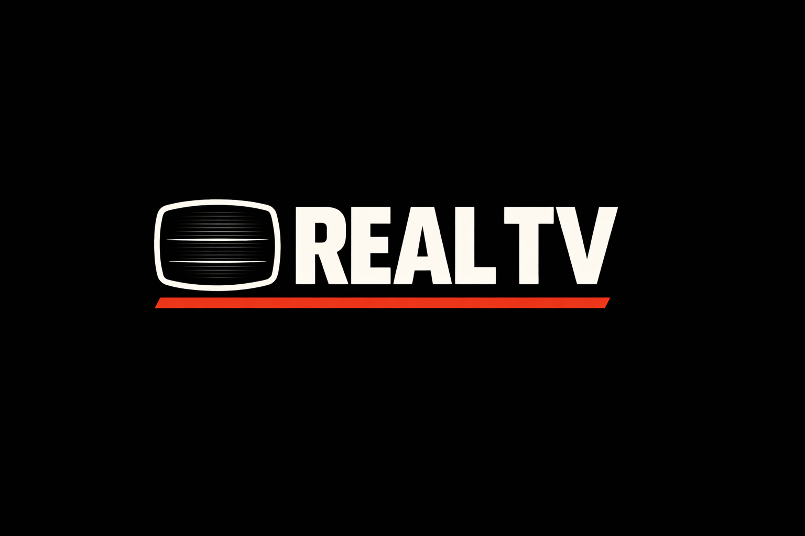
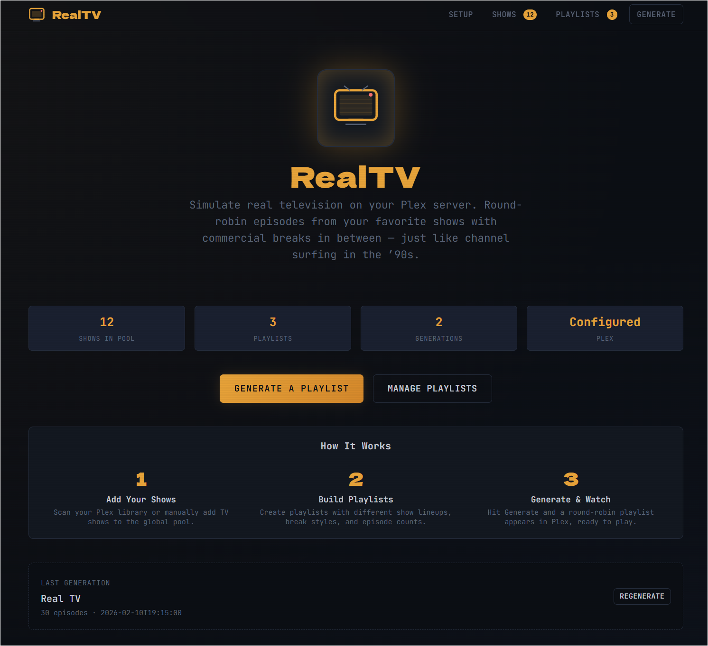
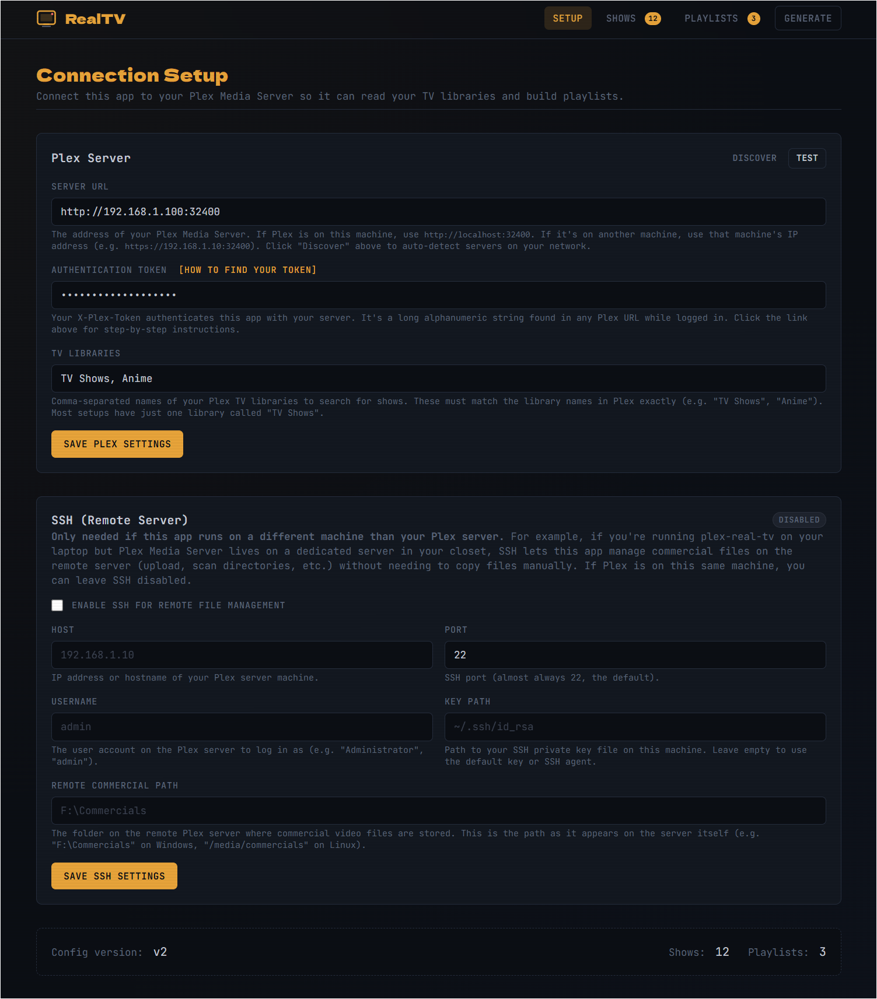

<p align="center">
  
</p>

<h1 align="center">plex-real-tv</h1>

<p align="center">
  <strong>Turn your Plex library into a TV channel — episodes cycle through your shows in order with commercial breaks in between.</strong>
</p>

<p align="center">
  
  
  
  
</p>

<p align="center">
  <a href="#features">Features</a> &middot;
  <a href="#quick-start">Quick Start</a> &middot;
  <a href="#web-ui">Web UI</a> &middot;
  <a href="#cli">CLI</a> &middot;
  <a href="#how-it-works">How It Works</a> &middot;
  <a href="#command-reference">Commands</a>
</p>

---

Pick the shows you want, add some commercials if you like, and run `rtv generate`. You get a Plex playlist that plays like a cable channel — an episode of Seinfeld, a vintage commercial, an episode of The Office, another commercial, and so on. Each show picks up where it left off, so the next time you generate you get the next episodes in order.

<p align="center">
  
</p>

---

## Features

- **Three ways to use it** — browser-based Web UI, full-screen terminal TUI, or the CLI
- **Automatic episode ordering** — cycles through your shows oldest-to-newest, one episode at a time, picking up where you left off
- **Commercial breaks** — one random clip per break, or blocks that fill a time window like real TV. Configurable no-repeat window so you don't see the same one twice
- **Multiple playlists** — create "Real TV", "90s Night", "Anime Block", each with their own shows and positions
- **Fuzzy matching** — type `rtv add-show "the office"` and it finds "The Office (US)" in your Plex library
- **Commercial library builder** — search and download clips with built-in yt-dlp integration, or just drop MP4s in a folder
- **Remote server support** — SSH/SFTP for managing commercials on a separate Plex server
- **Works over SSH** — the terminal TUI runs on headless servers

---

## Quick Start

### What you need

- **[Python 3.11 or newer](https://www.python.org/downloads/)** — check with `python --version` (or `python3 --version` on macOS/Linux)
- **[Plex Media Server](https://www.plex.tv/)** running and accessible on your network
- **Your Plex token** — [how to find it](https://support.plex.tv/articles/204059436-finding-an-authentication-token-x-plex-token/)

### Install and run

```bash
# Download the project
git clone https://github.com/travisjneuman/plex-real-tv.git
cd plex-real-tv

# Install
pip install .

# Set up your Plex connection
rtv init

# Add some shows
rtv add-show "Seinfeld"
rtv add-show "The Office"

# Generate your playlist
rtv generate
```

Open Plex, go to **Playlists** in the sidebar, find **"Real TV"**, and hit play.

> [!TIP]
> **Commercials are optional.** The Quick Start above creates a playlist with just episodes. To add commercial breaks, see [Commercial Library Setup](#commercial-library-setup) below.

> [!NOTE]
> **Don't have git?** You can also [download the ZIP](https://github.com/travisjneuman/plex-real-tv/archive/refs/heads/master.zip), extract it, and run `pip install .` from inside the folder.

<details>
<summary><strong>For developers</strong> — editable install</summary>
<br>

If you plan to modify the source code, install in editable mode:
```bash
pip install -e ".[dev]"
```

This also installs test dependencies (pytest, httpx, etc.).
</details>

### Updating

```bash
cd plex-real-tv
git pull
pip install .
```

---

## Web UI

```bash
rtv web                    # Launch on port 8080
rtv web --port 3000        # Custom port
rtv web --no-open          # Don't auto-open browser
```

Accessible from any device on your network at `http://<your-ip>:8080`.

> [!NOTE]
> The Web UI is served from your machine, but your **browser** needs internet access to load styling and interactivity from CDNs: [Tailwind CSS](https://tailwindcss.com/), [htmx](https://htmx.org/), and [Google Fonts](https://fonts.google.com/). The CLI and TUI work fully offline.

<p align="center">
  
</p>

<details>
<summary><strong>Setup page</strong> — Plex connection, server discovery, SSH</summary>
<br>
<p align="center"></p>
</details>

<details>
<summary><strong>Playlists page</strong> — create/edit playlists, manage shows, configure breaks</summary>
<br>
<p align="center"></p>
</details>

<details>
<summary><strong>Generate page</strong> — live progress bar with TV static animation</summary>
<br>
<p align="center"></p>
</details>

---

## CLI

### Shows

```bash
rtv add-show "the office"                  # Fuzzy match against Plex
rtv add-show "Dragon Ball Z" --library "Anime"
rtv list-shows                             # Pool with status + membership
rtv remove-show "Seinfeld"
rtv enable-show "The Office (US)"
rtv disable-show "Friends"
```

### Playlists

```bash
rtv create-playlist "Late Night"
rtv playlist-add "Late Night" "Seinfeld"
rtv playlist-remove "Late Night" "Friends"
rtv list-playlists
rtv delete-playlist "Late Night"
rtv set-default "90s Night"
```

### Generation

```bash
rtv generate                    # Default playlist
rtv generate "90s Night"        # Specific playlist
rtv generate -e 50              # Custom episode count
rtv generate --from-start       # Reset all shows to S01E01
rtv generate --rescan           # Rescan Plex library first
rtv generate --export           # Auto-export to CSV after generating
```

### Commercials

```bash
rtv find-commercials -c "80s"              # Search YouTube
rtv download-commercials URL -c "90s"      # Download by URL
rtv download-commercials --from-search -c "80s"  # Download from last search
rtv add-category "PSAs" -s "vintage PSA" -w 0.5
rtv list-commercials
```

### Diagnostics & Export

```bash
rtv doctor                      # Check everything
rtv status                      # Plex connection + inventory
rtv preview -e 10               # Dry-run preview (no changes)
rtv history                     # Last 5 generations
rtv export                      # Export playlist to CSV
rtv export --format json -n "90s Night"
```

---

## Terminal TUI

```bash
rtv tui
```

Full-screen terminal interface. Works over SSH for headless servers.

| Key | Screen |
|-----|--------|
| <kbd>d</kbd> | Dashboard — Plex status, stats, last generation |
| <kbd>s</kbd> | Shows — searchable table, toggle enabled/disabled |
| <kbd>p</kbd> | Playlists — create, edit, generate, set default |
| <kbd>q</kbd> | Quit |

---

## How It Works

When you run `rtv generate`, the tool builds a Plex playlist by cycling through your shows one episode at a time:

```
Episode 1: Seinfeld S03E12
  [Commercial: random 80s clip]
Episode 2: The Office S01E01
  [Commercial: different clip — no repeats]
Episode 3: Friends S05E08
  [Commercial: another unique clip]
Episode 4: Seinfeld S03E13
  ...
```

Each show keeps its own position (season + episode) **per playlist**, so "Real TV" can be at Seinfeld S05E03 while "90s Night" is still at S01E01. Positions are saved after each generation. If a show runs out of episodes, it drops out and the rest continue.

### Break Styles

Each playlist can use a different commercial break style:

| Style | What it does |
|-------|-------------|
| `single` | One random commercial between episodes (default) |
| `block` | Multiple commercials filling a time window — like a real TV break |
| `disabled` | No commercials at all |

<details>
<summary><strong>Architecture</strong></summary>
<br>

Three interfaces share one core engine:

```
┌─────────────┐  ┌─────────────┐  ┌─────────────┐
│   Web UI    │  │ Terminal TUI│  │     CLI     │
│ FastAPI +   │  │  Textual    │  │   Click     │
│ htmx/Jinja2 │  │             │  │             │
└──────┬──────┘  └──────┬──────┘  └──────┬──────┘
       │                │                │
       └────────────────┼────────────────┘
                        │
              ┌─────────┴─────────┐
              │    Core Layer     │
              │  config.py        │
              │  playlist.py      │
              │  plex_client.py   │
              │  commercial.py    │
              │  matcher.py       │
              └───────────────────┘
```
</details>

---

## Configuration

`rtv init` walks you through setup interactively. All settings are stored in `config.yaml`.

> [!NOTE]
> RTV looks for `config.yaml` in your current directory first, then `~/.config/rtv/config.yaml`. Run commands from the same folder where you ran `rtv init`.

<details>
<summary><strong>Full config reference</strong></summary>

```yaml
config_version: 2

plex:
  url: "http://192.168.1.100:32400"
  token: "your-plex-token-here"
  tv_libraries:
    - "TV Shows"
  tv_show_paths:
    - "D:\\TV Shows"
    - "E:\\TV Shows"

# Global show pool
shows:
  - name: "Seinfeld"
    library: "TV Shows"
    year: 1989
    enabled: true
  - name: "The Office (US)"
    library: "TV Shows"
    year: 2005
    enabled: true

# Named playlists with independent settings and positions
playlists:
  - name: "Real TV"
    shows:
      - { name: "Seinfeld", current_season: 3, current_episode: 7 }
      - { name: "The Office (US)", current_season: 1, current_episode: 1 }
    breaks:
      enabled: true
      style: single       # single | block | disabled
      frequency: 1         # break every N episodes
      min_gap: 50           # no-repeat window for commercials
      block_duration: { min: 30, max: 120 }
    episodes_per_generation: 30
    sort_by: premiere_year  # premiere_year | premiere_year_desc | alphabetical

default_playlist: "Real TV"

# Optional SSH for remote Plex servers
ssh:
  enabled: false
  host: ""
  port: 22
  username: ""
  key_path: ""
  remote_commercial_path: ""

commercials:
  library_name: "RealTV Commercials"
  library_path: "D:\\Media\\Commercials"
  block_duration: { min: 120, max: 300 }
  categories: []

history: []
```
</details>

Existing v1 configs auto-migrate on first load (backs up to `config.yaml.v1.bak`).

---

## Commercial Library Setup

Commercials are optional but fun. You need two things: MP4 files in a folder, and a Plex library pointing to that folder.

### 1. Create the folder

Organize by decade, theme, or however you like — each subfolder becomes a category:

```
D:\Media\Commercials\
├── 80s/
│   ├── Coca Cola 1985.mp4
│   └── Nintendo NES Commercial.mp4
├── 90s/
│   └── Got Milk 1993.mp4
└── PSAs/
    └── This Is Your Brain On Drugs.mp4
```

### 2. Add the library in Plex

1. Plex → Settings → Libraries → **Add Library**
2. Type: **Movies** (not TV Shows — commercials are single files)
3. Name it `RealTV Commercials` (must match your config)
4. Point it to your commercial folder
5. Let Plex scan the library

> [!TIP]
> Hide the commercial library from your Plex home screen: Settings → Libraries → RealTV Commercials → gear icon → uncheck "Include in dashboard".

### 3. Find and download commercials

```bash
rtv find-commercials -c "80s"              # Search YouTube
rtv download-commercials --from-search -c "80s"  # Download results
```

Or just drop any MP4 files into your commercial folder and let Plex scan.

> [!IMPORTANT]
> You're responsible for ensuring your use of yt-dlp and any downloaded content complies with applicable terms of service and copyright law. RTV does not include or distribute any media files.

---

## Advanced

<details>
<summary><strong>Multi-drive setup</strong> — TV shows spread across multiple drives</summary>

```yaml
plex:
  tv_show_paths:
    - "D:\\TV Shows"
    - "E:\\TV Shows"
    - "F:\\TV Shows"
    - "K:\\TV Shows"
```

`rtv add-show` searches all configured libraries automatically.
</details>

<details>
<summary><strong>Remote server (SSH)</strong> — Plex on a different machine</summary>

Configure via the Web UI Setup page, or in `config.yaml`:

```yaml
ssh:
  enabled: true
  host: "192.168.1.10"
  port: 22
  username: "admin"
  key_path: "~/.ssh/id_rsa"
  remote_commercial_path: "F:\\Commercials"
```

SSH enables remote commercial directory scanning, SFTP file uploads, and remote command execution.
</details>

<details>
<summary><strong>Dependencies</strong> — what gets installed</summary>
<br>

All installed automatically via `pip install .`:

| Category | Package | Purpose |
|----------|---------|---------|
| **Core** | [`click`](https://click.palletsprojects.com/) | CLI framework |
| | [`PlexAPI`](https://github.com/pkkid/python-plexapi) | Plex server communication |
| | [`yt-dlp`](https://github.com/yt-dlp/yt-dlp) | Commercial search & download |
| | [`pyyaml`](https://github.com/yaml/pyyaml) | Config parsing |
| | [`pydantic`](https://docs.pydantic.dev/) | Config validation |
| | [`rapidfuzz`](https://github.com/rapidfuzz/RapidFuzz) | Fuzzy show matching |
| | [`rich`](https://github.com/Textualize/rich) | Terminal formatting |
| **Web UI** | [`fastapi`](https://fastapi.tiangolo.com/) | Web framework |
| | [`uvicorn`](https://www.uvicorn.org/) | ASGI server |
| | [`jinja2`](https://jinja.palletsprojects.com/) | HTML templates |
| | [`sse-starlette`](https://github.com/sysid/sse-starlette) | Live progress events |
| **TUI** | [`textual`](https://textual.textualize.io/) | Terminal UI framework |
| **Remote** | [`paramiko`](https://www.paramiko.org/) | SSH/SFTP |

The Web UI also loads from CDN (browser-side, not installed):
[Tailwind CSS](https://tailwindcss.com/), [htmx](https://htmx.org/), [htmx SSE extension](https://htmx.org/extensions/server-sent-events/), and [Google Fonts](https://fonts.google.com/) (Dela Gothic One + JetBrains Mono).
</details>

---

## Troubleshooting

<details>
<summary><strong>"Could not connect to Plex"</strong></summary>

1. Is Plex Media Server running?
2. Is the URL correct? Try `http://localhost:32400` if Plex is on the same machine, or `http://<server-ip>:32400` for a remote server
3. Is the token valid? Tokens can expire — [get a new one](https://support.plex.tv/articles/204059436-finding-an-authentication-token-x-plex-token/)
4. Firewall blocking port 32400?
5. Run `rtv doctor` for a full diagnostic
</details>

<details>
<summary><strong>"No match found" when adding a show</strong></summary>

- Try the exact name as it appears in Plex
- Check which libraries are configured: `rtv status`
- Use `--library` to search a specific library: `rtv add-show "Show" --library "Anime"`
</details>

<details>
<summary><strong>"No commercials found"</strong></summary>

1. Have you downloaded any? `rtv find-commercials -c "80s"`
2. Is the commercial path correct? Check with `rtv doctor`
3. Did you create the **Movies** library in Plex and let it scan?
4. Commercial files must be `.mp4` format
</details>

<details>
<summary><strong>"rtv: command not found" after installing</strong></summary>

This means Python's script directory is not in your system PATH.

**Windows:**
```
python -m rtv.cli --help
```
Or add Python's Scripts folder to PATH: search "Environment Variables" in Windows settings, edit `Path`, add `%APPDATA%\Python\Python3XX\Scripts` (replace `XX` with your Python version).

**macOS / Linux:**
```bash
python3 -m rtv.cli --help
```
Or add `~/.local/bin` to your PATH:
```bash
echo 'export PATH="$HOME/.local/bin:$PATH"' >> ~/.bashrc
source ~/.bashrc
```
</details>

`rtv doctor` checks everything: Plex connection, libraries, shows, commercial path, yt-dlp availability.

---

## Command Reference

| Command | Description |
|---------|-------------|
| `rtv init` | Create config interactively |
| `rtv status` | Test Plex connection, show inventory |
| `rtv doctor` | Full diagnostic check |
| **Shows** | |
| `rtv add-show NAME` | Add show to pool (fuzzy matched) |
| `rtv remove-show NAME` | Remove show |
| `rtv list-shows` | List pool with status |
| `rtv enable-show NAME` | Enable a show |
| `rtv disable-show NAME` | Disable a show |
| **Playlists** | |
| `rtv create-playlist NAME` | Create playlist |
| `rtv delete-playlist NAME` | Delete playlist |
| `rtv list-playlists` | List all playlists |
| `rtv playlist-add PLAYLIST SHOW` | Add show at S01E01 |
| `rtv playlist-remove PLAYLIST SHOW` | Remove show |
| `rtv set-default NAME` | Set default playlist |
| **Generation** | |
| `rtv generate [NAME]` | Generate Plex playlist |
| `rtv generate --from-start` | Reset to S01E01 |
| `rtv generate --rescan` | Rescan Plex first |
| `rtv generate --export` | Export after generating |
| `rtv preview [NAME]` | Dry-run preview |
| `rtv export` | Export to CSV/JSON |
| `rtv history` | Last 5 generations |
| **Commercials** | |
| `rtv find-commercials -c CAT` | Search for commercials |
| `rtv download-commercials URL` | Download by URL |
| `rtv add-category NAME` | Add category |
| `rtv list-commercials` | Show inventory |
| **Interfaces** | |
| `rtv web` | Launch Web UI |
| `rtv tui` | Launch Terminal TUI |

---

## Disclaimer

This tool generates playlists from media you already own in your Plex library. It does not distribute, stream, or share any media content. Commercial clips are sourced and stored locally by the user — RTV does not include or distribute any media files.

## License

[MIT](LICENSE)
